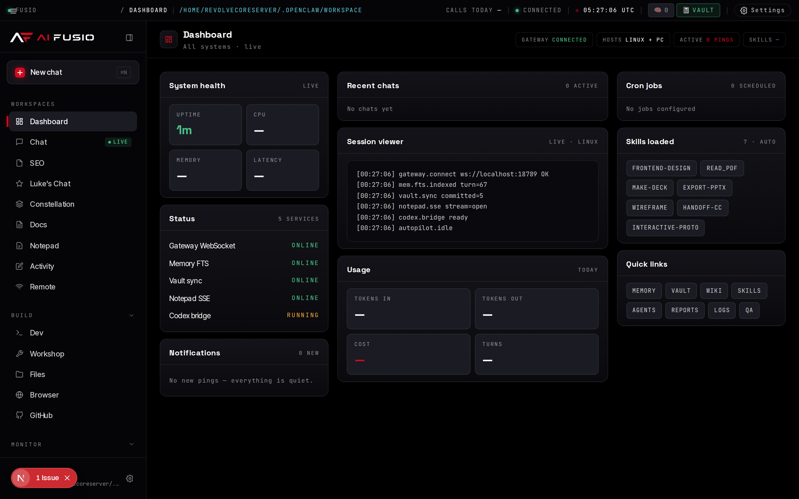
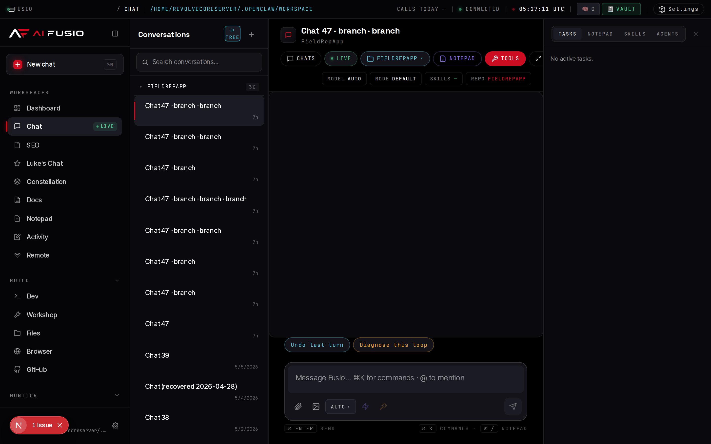
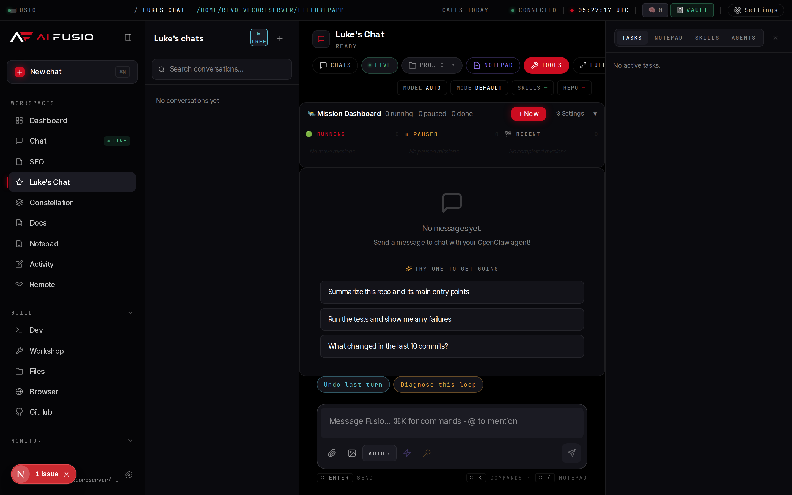

# Fusio — Single-User Agentic Operations Console

> Internal codename: **Mission Control**. A local web app that orchestrates Claude (or Codex, or any other LLM via the MCP fabric) with persistent SQLite memory, a 5-repo skill library, multi-agent missions, an optional Tailscale-powered cross-machine bridge, and a mobile PWA.

This is what every commercial agent tool would ship if they didn't have multi-tenant concerns to worry about. Runs as a Next.js web app at `localhost:3001`, fully local, fully yours.

> **🚀 Visit [aifusio.com/mission-control](https://aifusio.com/mission-control.html)** for the full marketing page, deep setup walkthrough, FAQ, and what AI Fusio can build for your business. This README is the engineering quick-start; the website is the comprehensive product page.



*The Dashboard — system health, recent chats, cron jobs, status, session viewer, skills loaded, usage, notifications, quick links.*

---

## Why use this

- **Per-turn auto-loaded skills** from a curated 400+ skill library — methodology, design systems, language patterns, domain knowledge. No `@-mention` ceremony, the right skills just inject themselves.
- **Real persistent memory** in SQLite with semantic retrieval. The agent remembers cross-session and queries memory itself; you don't have to re-narrate context every day.
- **Cross-provider scrutiny** — Claude builds, Codex (GPT-5) audits, Playwright validates behaviorally. Different model families, no training-data correlation bias.
- **Multi-machine bridge** over Tailscale (or any network) — work on two boxes, see each other's edits per-turn, hand off long-running tasks.
- **Validation contract before code** — for multi-phase deliverables, typed assertions get written first, workers can't claim done until scrutiny + behavioral checks pass.
- **Mobile PWA** with the same chat, same skills, same memory, same cross-machine view.
- **No multi-tenant friction** — no auth, no rate-limits, no "this requires Pro". You have full root.

---

## Quick start

```bash
# Recommended — one-shot scaffolder
npx @aifusiomc/create-fusio
cd fusio
npm run dev
```

Or the manual way:

```bash
git clone https://github.com/reinvention18/fusio.git
cd fusio
npm install
npm run dev
```

Open `http://localhost:3001`.

Then drop your Anthropic API key into Settings → Credentials. That's the whole onboarding.

For deeper setup (mobile PWA, cross-machine peers, skill repos, missions, teams) see `docs/`.

---

## Screenshots

### Chat surface



*Sessions sidebar + project pill + model/mode/skills/repo status chips + Notepad and Tools menus. The composer at the bottom handles attachments, mentions, slash-commands, and the new fullscreen "terminal-look" toggle.*

### Luke's Chat — multi-agent missions



*Phase-by-phase mission orchestrator. Orchestrator (Opus) plans, Workers (Sonnet) implement, Scrutiny (GPT-5 Codex) audits cross-provider, Playwright validates behaviorally. Survives MC restarts via persistent state + checkpoints.*

---

## What you actually get

| Surface | What it does |
|---|---|
| **Chat** | The primary interaction. Three namespaces (default, SEO, missions), each with isolated storage but shared chat machinery. |
| **Missions** | Multi-agent multi-phase deliverables. Orchestrator (Opus) plans + writes assertions; Worker (Sonnet) implements with fresh context per phase; Scrutiny (Codex) audits; User-testing (Playwright) walks the flow. Self-heals up to 3 follow-up phases. Survives MC restarts. |
| **Teams (Constellation)** | Multi-stream parallel work with 16 specialist roles + 12 presets. Architect proposes plan, agents work in parallel, ship gate runs final audit before merging the worktree. |
| **Dev tab** | DeployDashboard, GitPanel, TestRunner, ApiTester, DatabaseExplorer, ErrorTracker, CodeSnippets, embedded ClaudeCodeTerminal + xterm.js shell + CodeMirror editor. |
| **Dashboard** | 12 cards: memory feed, usage stats, activity feed, skills manager, sessions viewer, cron calendar, command bar, notifications, scratchpad, quick links, cron jobs, claude terminal. |
| **Browser** | Embedded Playwright. Connects to your real Chrome via CDP if it's running with `--remote-debugging-port=9222`. Headless fallback. |
| **Remote** | Embedded iframes of peer MC instances over Tailscale, with reachability dots. You can interact with the other machine's MC inside this one. |
| **Memory Vault** | Obsidian-format wiki mirrored to a Git repo, auto-committed every 30s, auto-pulled every 5min. Exposed as MCP tools so the chat agent can read/write notes. |
| **Terminal mode** | Fullscreen chat that looks like Claude Code in a real terminal — monospace, no bubbles, no chrome, just `>` prompt. Toggle with `⌘.` or the `Full` pill. |

---

## Stack

- **Next.js 15** (App Router, RSC, Server Actions)
- **React 19**
- **TypeScript 5.7**
- **Tailwind CSS 3.4** (+ a 43KB hand-tuned design CSS at `public/fusio/mc.css`)
- **better-sqlite3** for the memory layer
- **@anthropic-ai/claude-agent-sdk** for the chat bridge
- **Playwright** for browser automation
- **@huggingface/transformers** for local embedding (no external embedding API)
- **PM2** for process management (optional but recommended)

Runs on **Linux**, **Windows**, **macOS**. Daily use is fine in `next dev`; production is `npm run build` (16GB heap required) + `npm start`.

---

## Configuration

Everything is configured at runtime via Settings panels or environment variables. No code changes needed.

### Inside the app

| Setting | Where |
|---|---|
| API keys (Anthropic, OpenAI, Resend, …) | Settings → Credentials |
| Integrations (Stripe, Tailscale, …) | Settings → Integrations |
| Active workspaces / projects | Project pill in chat header → "+ New project" |
| Model picker per session | Chat header → Model chip |
| Chat mode (Solo / Pair / Autopilot / Mission) | Chat header → Mode chip |
| Key Facts (auto-injected into every chat) | Chat header → Key Facts dropdown |
| Theme | Top-right Settings → Theme |

### Optional `.env.local` overrides

Copy `.env.example` to `.env.local` if you need to override defaults. Most setups don't need any of these — the in-app settings are enough.

### Optional cross-machine peers

Create `~/.config/mc-remote-hosts.json` on each machine:

```json
{
  "myToken": "shared-bearer-token-here",
  "myLabel": "Server A",
  "myUrl": "http://10.0.0.5:3001",
  "hosts": [
    {
      "id": "b",
      "label": "Workstation B",
      "url": "http://10.0.0.6:3001",
      "token": "shared-bearer-token-here"
    }
  ]
}
```

Symmetric `myToken` and `hosts[].token`. Once set, the cross-machine MCP tools (`mc_remote_ask`, `mc_remote_read`, etc.) and the Remote tab's iframe view become available. See `docs/CROSS-MACHINE-SETUP.md`.

### Optional mobile PWA

To install Fusio as a PWA on a phone, you need HTTPS — Chrome won't show the install prompt without it. Generate certs (Tailscale, Let's Encrypt, mkcert, whatever works for your network) and drop them at `certs/tls.crt` and `certs/tls.key`. The `mc-https` process in `ecosystem.config.js` serves the proxy on port 3443. See the header comment in `https-proxy.js` for the env-var overrides.

### Optional skill repos

Fusio auto-loads skills from any of these directories under `~/`:

- `~/.claude/plugins/cache/claude-plugins-official/superpowers/*/skills/` ([obra/superpowers](https://github.com/obra/superpowers))
- `~/everything-claude-code/skills/` ([affaan-m/everything-claude-code](https://github.com/affaan-m/everything-claude-code))
- `~/ruflo/.claude/skills/` ([ruvnet/ruflo](https://github.com/ruvnet/ruflo))
- `~/open-design/skills/` ([nexu-io/open-design](https://github.com/nexu-io/open-design))
- `~/obsidian-skills/skills/` ([kepano/obsidian-skills](https://github.com/kepano/obsidian-skills))

Clone any of them and the auto-loader picks them up next turn. You can also write your own — drop a `SKILL.md` into any of those dirs and add a regex trigger in `lib/skills-mcp.ts:SKILL_TRIGGERS`.

---

## Architecture overview

```
Browser ──┐
          ├──▶ Next.js (port 3001) ──▶ ChatPanel ──▶ Claude Agent SDK ──▶ Anthropic API
PWA ──────┤                              │
SSH/Terminal▶ Claude Code                ├──▶ MCP servers:
          │                              │       commander, mem, vault, skills, agents,
          │                              │       design-systems, docs, edits, remote, gitnexus
          │                              ├──▶ Approval gate (Bash + Edit/Write protected paths)
          │                              ├──▶ Memory pipeline (capture + auto-inject + semantic search)
          │                              └──▶ chat-broadcast (multi-device SSE fan-out)
          │
          └──▶ HTTPS proxy (port 3443) ──▶ Next.js (PWA)

Cross-machine:
  Machine A ◀── Tailscale ──▶ Machine B
       │                          │
       └── trust file ─────────────┘
       (mc-remote-hosts.json with symmetric bearer tokens)
```

See `docs/` for the per-subsystem deep dive.

---

## Repo layout

```
fusio/
├── app/                       # Next.js App Router
│   ├── api/                   # 50+ API routes (chat, missions, teams, git, etc.)
│   ├── page.tsx               # Main shell + tab routing
│   └── layout.tsx
├── components/
│   ├── ChatPanel.tsx          # The chat (8000 LOC — the big one)
│   ├── chat/                  # Chat sub-components (MessageBubble, MessageContent, ...)
│   ├── constellation/         # Teams UI
│   ├── fusio/                 # Design-system primitives (Sidebar, Topbar, ChatHeader, ...)
│   ├── mem/                   # Memory UI
│   └── (each tab's panel)     # CredentialsPanel, BrowserPanel, GitHubPanel, etc.
├── lib/
│   ├── claude-chat-bridge.ts  # The heart — Claude Agent SDK integration
│   ├── claude-sdk-session.ts  # Session-id mapping + namespace helpers
│   ├── missions/              # Mission runtime
│   ├── teams/                 # Team / Constellation runtime
│   ├── remote/                # Cross-machine MCP tools
│   ├── mem/                   # Memory facade + SQLite I/O
│   ├── vault/                 # Obsidian wiki integration
│   ├── skills-mcp.ts          # Skill auto-loader (5 sources, regex triggers)
│   ├── agents-mcp.ts          # Subagent persona loader
│   ├── design-systems-mcp.ts  # 150+ brand design systems
│   ├── chat-broadcast.ts      # In-process SSE fan-out
│   ├── approval-gate.ts       # Tool-call approval (Bash + protected paths)
│   ├── memory-*.ts            # Memory schema, indexing, embedding
│   └── (more)
├── public/
│   ├── fusio/mc.css           # 43KB design CSS — pixel-tuned Fusio palette
│   ├── manifest.json          # PWA manifest
│   └── sw.js                  # Service worker
├── docs/
│   ├── CROSS-MACHINE-SETUP.md
│   ├── MISSIONS_PLAN.md
│   ├── MULTI_AGENT_TEAMS_PLAN.md
│   ├── MEMORY-VAULT-INTEGRATION.md
│   └── (more)
├── data/                      # All runtime state (gitignored except .gitkeep)
│   ├── chats/                 # Per-chat JSON files
│   ├── seo-chats/             # SEO namespace chats
│   ├── lukes-chats/           # Missions namespace chats
│   ├── missions/<id>/         # Mission state + events + checkpoints
│   ├── notepads/              # Shared notepad files
│   ├── memory.db              # SQLite memory store
│   └── pending/               # In-flight stream buffers (chat + remote-chat)
├── memory/                    # Per-session memory logs (gitignored)
├── ecosystem.config.js        # PM2 config
├── https-proxy.js             # PWA HTTPS terminator
├── instrumentation.ts         # Boot hooks (memory pump, team boot, mission reattach, …)
├── next.config.js
├── tailwind.config.ts
├── tsconfig.json
├── CLAUDE.md                  # Agent context for Claude Code working in this repo
├── LICENSE                    # MIT
└── README.md                  # ← you are here
```

---

## Daily commands

```bash
# Development
npm run dev                          # http://localhost:3001

# Production
npm run build                        # needs 16GB heap (already in script)
npm start                            # http://localhost:3001

# With PM2 (auto-restart, kill-timeout drains, log rotate)
pm2 start ecosystem.config.js
pm2 logs mission-control
pm2 restart mission-control

# Type-check (build skips this for performance)
npx tsc --noEmit -p tsconfig.json

# Cross-machine git status check (if you set up peers)
curl http://localhost:3001/api/git/status
```

---

## Contributing

PRs welcome. The codebase is opinionated and single-stack on purpose — proposals to swap out major pieces (Next.js, better-sqlite3, the Claude Agent SDK) probably won't land. Smaller things — new skills, new MCP tools, new panels, new mission roles, design polish, bug fixes — are all great.

Read [`CLAUDE.md`](./CLAUDE.md) first if you're using an AI assistant to contribute. It's the primer the assistant loads automatically.

The 8000-line `ChatPanel.tsx` is the elephant in the room. We know. Splitting it without breaking the SDK session / cross-machine broadcast / chat-broadcast contracts is a real refactor — a properly-scoped issue with a migration plan is welcome.

---

## License

MIT. See [`LICENSE`](./LICENSE).

The bundled design CSS (`public/fusio/mc.css`) is part of the same MIT license.

---

## Want this built for your team?

Fusio is a project by **[AI Fusio](https://aifusio.com)** — a consulting practice that integrates AI into mid-market businesses (contractors, professional services, home services, manufacturing). We open-sourced this platform because the best demo of what we build is letting you run it yourself.

If you want the customized version — Mission Control integrated into your CRM, phones, documents, and team workflows, fully built and operated for you — we offer:

- **AI Opportunity Audit** — from $2,500. Prioritized AI roadmap + a working pilot.
- **AI Integration & Build** — from $10,000. Full integration scoped to your specific systems.
- **Managed AI Department** — from $1,500/month. Ongoing AI ops department for your business.

[**aifusio.com**](https://aifusio.com) · [Book a consultation](https://aifusio.com/#contact) · [Mission Control product page](https://aifusio.com/mission-control.html)

---

## A note on the codename

You'll see "Mission Control" and "MC" used interchangeably with "Fusio" throughout the code and docs. They're the same thing. The codename predates the brand. Internal-facing things like PM2 process names and the `--mission-control-log` argument keep the old name for compatibility; user-facing things use "Fusio."
